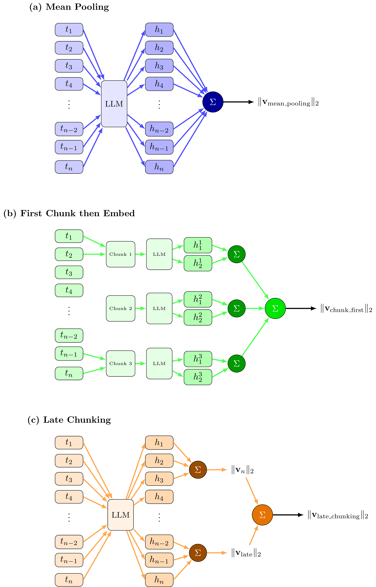

# Chunking Methods for Document Embeddings

This module implements four different strategies for generating document-level embeddings from text, each with distinct characteristics regarding length bias, computational efficiency, and representation quality.

## Overview

When embedding long documents, we face the challenge that transformer models have limited context windows. This module provides several approaches to handle documents that exceed model limits or to improve embedding quality through different pooling strategies.



## Implemented Methods

### 1. CLS Token (`CLSToken`)

**Strategy**: Uses the special classification token embedding directly from the transformer model.

**Process**:
- The full text is passed to the embedding model (truncated if exceeding model limits)
- The model's CLS token embedding is extracted as the document representation
- The vector is L2-normalized

**Characteristics**:
- Fastest method (single forward pass)
- Most memory efficient
- May lose information for long documents due to truncation
- No explicit handling of document length

**Use Case**: Best for short documents or when computational efficiency is critical.

### 2. Mean Pooling (`MeanPooling`)

**Strategy**: Averages all token-level hidden states to create a document embedding.

**Process**:
- The full text is embedded, producing token-level hidden states (`colbert_vecs`)
- All token embeddings are averaged across the sequence length
- The resulting mean vector is L2-normalized

**Characteristics**:
- Captures information from all tokens in the document
- Single forward pass through the model
- Subject to length bias: longer documents may dominate the representation
- Requires token-level embeddings (more memory than CLS token)

**Use Case**: Good baseline for documents that fit within model context limits.

### 3. Chunk-First Embedding (`ChunkFirstEmbed`)

**Strategy**: Split text into chunks first, embed each chunk independently, then pool the chunk embeddings.

**Process**:
1. Text is tokenized and split into overlapping chunks (configurable `chunk_size` and `stride`)
2. Each chunk is embedded separately using the model's CLS token
3. All chunk embeddings are mean-pooled
4. The final vector is L2-normalized

**Parameters**:
- `chunk_size`: Number of tokens per chunk (default: 512)
- `stride`: Overlap between chunks (default: 256)

**Characteristics**:
- Handles documents of arbitrary length
- Overlapping chunks preserve context at boundaries
- Multiple forward passes (one per chunk) - slower but more thorough
- Each chunk gets full model attention
- Final pooling combines chunk-level representations

**Use Case**: Best for very long documents that exceed model context windows.

**Variants Tested**:
- `ChunkFirstEmbed_512_256`: 512 tokens per chunk, 256 token stride
- `ChunkFirstEmbed_1024_512`: 1024 tokens per chunk, 512 token stride
- `ChunkFirstEmbed_2048_1024`: 2048 tokens per chunk, 1024 token stride

### 4. Late Chunking (`LateChunking`)

**Strategy**: Embed the full text once, then apply windowed pooling over the token-level hidden states.

**Process**:
1. The full text is embedded in a single forward pass, producing token-level hidden states
2. Overlapping windows are created over the hidden states (configurable `window_size` and `stride`)
3. Each window is mean-pooled and L2-normalized independently
4. The normalized window embeddings are then averaged (unit-sphere centroid)
5. The final vector is L2-normalized again

**Parameters**:
- `window_size`: Number of tokens per window (default: 512)
- `stride`: Overlap between windows (default: 256)

**Characteristics**:
- Single forward pass (efficient)
- Two-stage normalization removes length bias
- Window-level normalization before aggregation is critical for bias reduction
- Requires token-level embeddings (memory intensive)
- Better preserves local context through windowing

**Use Case**: Best balance between efficiency and quality for long documents, especially when length bias is a concern.

**Variants Tested**:
- `LateChunking_512_256`: 512 token windows, 256 token stride
- `LateChunking_1024_512`: 1024 token windows, 512 token stride
- `LateChunking_2048_1024`: 2048 token windows, 1024 token stride
- `LateChunking_2048_512`: 2048 token windows, 512 token stride (more overlap)
- `LateChunking_512_0`, `LateChunking_1024_0`, `LateChunking_2048_0`: Non-overlapping windows

## Technical Details

### Common Features

All methods:
- Inherit from `ChunkBase` abstract base class
- Use a shared `EmbeddingService` for consistency
- Return L2-normalized embeddings (unit vectors)
- Support batch processing via `embed_batch()` method
- Handle empty texts gracefully (return zero vectors)

### Normalization Strategy

All methods apply L2 normalization to ensure embeddings lie on the unit sphere, enabling cosine similarity for distance calculations. Late Chunking uses a two-stage normalization approach:
1. Normalize each window embedding individually
2. Compute unit-sphere centroid of normalized windows
3. Normalize the final aggregated vector

This two-stage process is critical for removing length bias in Late Chunking.

### Implementation Notes

- **Batch Processing**: All methods implement efficient batch processing to handle large datasets
- **Memory Management**: Methods optimize GPU memory usage, especially important for token-level embeddings
- **Tokenizer Consistency**: Chunk-First Embedding uses the same tokenizer as the embedding model to ensure consistent chunking
- **Error Handling**: Robust handling of edge cases (empty texts, model limits, etc.)

## Usage

```python
from src.aab_analysis.chunking import MeanPooling, CLSToken, ChunkFirstEmbed, LateChunking
from src.aaa_data_pipline.embedding.embedding import EmbeddingService

# Initialize embedding service
embedding_service = EmbeddingService("BAAI/bge-m3", ["cuda:0"])

# Create chunking method
method = LateChunking(
    embedding_service=embedding_service,
    model_name="BAAI/bge-m3",
    window_size=512,
    stride=256
)

# Embed single text
embedding = method.embed("Your document text here...")

# Embed batch of texts
embeddings = method.embed_batch(texts, batch_size=32)
```

## Experimental Evaluation

The `manager.py` script orchestrates comprehensive evaluation of all chunking methods, computing:
- Length-norm correlations
- Isotropy metrics (PCA analysis)
- Genre clustering quality (silhouette scores)
- Temporal drift stability
- Computational efficiency metrics

Results are saved with detailed metrics and comparison visualizations.

## Performance Results

### Results Table

| Method | Length-Norm Corr | Isotropy (1st PC %) | Silhouette | Sep. Ratio |
|--------|-----------------|---------------------|------------|------------|
| Mean Pooling | 0.629 | 11.36 | -0.036 | 0.943 |
| CLS Token | 0.004 | 3.32 | -0.016 | 0.958 |
| Chunk-First 512/256 | -0.366 | 3.47 | -0.020 | 0.951 |
| Chunk-First 1024/512 | -0.275 | 3.37 | -0.017 | 0.959 |
| Chunk-First 2048/1024 | -0.031 | 3.33 | -0.016 | 0.961 |
| Late Chunk 512/256 | 0.822 | 11.92 | -0.037 | 0.949 |
| Late Chunk 1024/512 | 0.726 | 11.53 | -0.037 | 0.948 |
| Late Chunk 2048/1024 | 0.656 | 11.36 | -0.036 | 0.958 |
| Late Chunk 2048/512 | 0.656 | 11.36 | -0.036 | 0.958 |
| Late Chunk 512/0 | 0.821 | 11.40 | -0.037 | 0.948 |

**Metrics Explained:**
- **Length-Norm Corr**: Correlation between document length and embedding norm. Positive values indicate length bias (longer documents have larger norms), negative values indicate inverse bias, near-zero indicates length-agnostic embeddings.
- **Isotropy (1st PC %)**: Variance explained by the first principal component. Lower values (3-4%) indicate more uniform, isotropic embeddings; higher values (11-12%) suggest directional bias.
- **Silhouette**: Cluster cohesion metric for genre classification. Negative values indicate substantial genre overlap in embedding space.
- **Sep. Ratio**: Intra-class to inter-class similarity ratio. Higher values (closer to 1.0) indicate better separation between classes.

### Key Findings

**Length Bias Analysis:**
The evaluation reveals substantial variation in length-norm correlation across methods. Mean Pooling and Late Chunking show strong positive correlation (0.62 to 0.82), indicating that longer documents produce embeddings with larger norms. This length bias can affect similarity calculations, as longer documents may appear more similar to each other simply due to their length. In contrast, Chunk-First Embedding exhibits negative correlation (down to -0.37), with larger chunk sizes approaching near-zero correlation (-0.031 for 2048/1024). CLS Token achieves near-zero correlation (0.004), effectively removing length bias entirely.

**Isotropy Analysis:**
Isotropy measurements reveal two distinct groups. Mean Pooling and Late Chunking have higher first-PC variance (11.3-11.9%), suggesting less uniform embeddings with directional bias. CLS Token and Chunk-First Embedding achieve lower values (3.3-3.5%), indicating better isotropy and more uniform distribution of information across dimensions. This suggests that chunking strategies that process text in segments before aggregation produce more balanced representations.

**Genre Classification:**
All methods show negative silhouette scores (-0.016 to -0.037), indicating substantial genre overlap in the embedding space. This reflects the multi-genre nature of movies and the semantic similarity between related genres (e.g., action-thriller, drama-romance). Separation ratios range from 0.943 to 0.961, with CLS Token and Chunk-First 2048/1024 achieving the highest values (0.958-0.961), indicating better class separation despite the overall genre overlap.

**Cosine Similarity Distributions:**
Cosine similarity distributions show consistent means (0.485-0.505) across all methods, but differ in concentration. CLS Token and Chunk-First Embedding produce more concentrated distributions (std: 0.061-0.067), while pooling-based methods (Mean Pooling, Late Chunking) show wider spreads (std: 0.123-0.126). This suggests that chunking-based methods create more discriminative embeddings with clearer separation between similar and dissimilar documents.

**Method Selection Guidelines:**
- **For length-agnostic embeddings**: Use CLS Token or Chunk-First Embedding with large chunk sizes (2048/1024)
- **For isotropic representations**: Prefer CLS Token or Chunk-First Embedding (3.3-3.5% first PC variance)
- **For computational efficiency**: CLS Token is fastest; Late Chunking balances efficiency with quality
- **For long documents**: Chunk-First Embedding handles arbitrary length; Late Chunking requires full text to fit in model context

## Conclusion

For the simplistic case, we chose **CLS Token** as the primary embedding method. This decision is supported by several key advantages:

1. **Length-agnostic**: CLS Token achieves near-zero length-norm correlation (0.004), effectively removing length bias that affects other methods
2. **High isotropy**: With only 3.32% variance in the first principal component, CLS Token produces the most uniform and isotropic embeddings
3. **Computational efficiency**: As the fastest method requiring only a single forward pass, CLS Token is ideal for large-scale processing
4. **Good separation**: Achieves one of the highest separation ratios (0.958), indicating effective class discrimination
5. **Concentrated similarity distribution**: Produces more discriminative embeddings with tighter similarity distributions (std: 0.061-0.067)

While CLS Token may truncate very long documents, for typical document lengths that fit within model context windows, it provides the best balance of quality, efficiency, and bias reduction. The method's strong performance across multiple metrics, combined with its simplicity and speed, makes it the optimal choice for straightforward embedding tasks.
